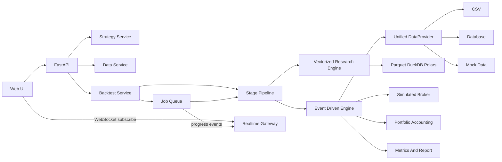

# Quantpilot 开发文档

本开发文档描述 Quantpilot 量化回测平台的产品定位、技术架构、核心领域模型、分阶段交付路线、工程规范与风险控制，作为所有开发者和贡献者的统一参考。

## 1. 产品定位

Quantpilot 是面向研究员的股票量化策略研究与回测平台。首个版本定位为**本地 / 内网单用户研究平台**：研究员可以导入数据、在 Web IDE 中编写 Python 策略、提交回测、查看可视化报告。多用户协作、权限、评论、策略市场、Tick 高频、母子账户等能力放到后续阶段。

首期市场范围：

- 标的：以 A 股为主，结构上预留 ETF / 指数 / 期货扩展。
- 频率：日线和分钟线，Tick 数据接口预留抽象但不进入 MVP 主路径。
- 部署形态：本地或内网单机；多人协作和云端部署在核心闭环稳定后再启动。

## 2. 设计原则

> 核心闭环优先，先进技术延后接入。

| 原则 | 说明 |
| --- | --- |
| 单机闭环 | 第一周必须跑通模拟数据 / CSV → 双均线策略 → Bar 回测 → 资金曲线 / 交易明细 / 核心指标。 |
| 薄抽象优先 | 第一周只实现最必要的工程抽象：`RuntimeConfig`、`DataProvider`、`BacktestEngine`、`Portfolio`、`Metrics`、基础 API、一个结果页面。 |
| 接口先于实现 | `JobRegistry`、`PipelineStage`、`ErrorEnvelope`、WebSocket、Parquet 数据湖等先定义接口边界，单次回测稳定后再逐步落地。 |
| 安全分级 | Python 策略执行首期仅面向**本地可信用户**。一旦进入多用户或共享环境，必须先做沙箱、超时、内存/文件/网络限制和依赖白名单。 |
| 分域组织 | 从第一天起按 `data`、`strategy`、`engine`、`analysis`、`jobs`、`realtime`、`api` 分域组织代码，避免平台长大后难拆。 |
| 宿主无关 | 协议模型、回测内核、指标计算做成宿主无关模块，Web API、CLI、未来桌面版作为不同宿主调用同一内核。 |

## 3. 技术架构

### 3.1 总体技术选型

- **前端**：React 18 + Vite + TypeScript + React Router + TanStack Query + Monaco Editor + Ant Design + ECharts。
- **后端**：Python 3.10+ + FastAPI（ASGI），独立可测试的回测引擎模块。
- **回测核心**：Python 事件驱动引擎，与 Web API 解耦，可单独运行和单测。
- **数据层**：统一 `DataProvider` 抽象。MVP 实现 CSV 与 Mock；中期引入 Parquet + DuckDB + Polars 作为数据湖。
- **任务执行**：MVP 使用本地进程 / 线程队列；后续升级 Celery / RQ + Redis。按 workload 分队列：轻量 API、数据导入、回测、参数优化分别走不同队列。
- **实时通道**：FastAPI ASGI + WebSocket。回测进度、日志、指标快照、完成 / 失败事件通过 WebSocket 推送。SSE 仅作为更轻量的备选。
- **存储**：MVP 使用 SQLite 存元数据和任务结果；进入多人协作或服务化部署后迁移 PostgreSQL。行情长期主存储使用 Parquet，本地文件系统起步，后续可迁移对象存储。
- **本地编排**：`docker-compose.dev.yml`，后续统一拉起 API、前端、Redis、worker、数据库。脚本使用相对路径和环境变量，避免写死机器路径。

### 3.2 模块边界

```
frontend/                 React + Vite 前端
backend/
  app/
    api/                  FastAPI 路由（按领域拆分，避免巨型路由文件）
    core/                 RuntimeConfig、错误模型、tracing
    data/                 DataProvider 抽象、CSV / Mock / Parquet 适配
    strategy/             策略基类、内置模板、指标库、参数 schema
    engine/               事件驱动回测、撮合、组合、成本模型
    analysis/             绩效指标、报告数据
    jobs/                 任务注册、状态机、队列适配
    realtime/             WebSocket gateway、事件发布器
    pipeline/             Stage / Pipeline 编排
    storage/              元数据 / 结果持久化
```

### 3.3 架构示意图



### 3.4 双引擎策略

平台同时支持两类研究引擎，二者共享数据层、指标层和报告层：

- **向量化研究引擎**：基于 Polars / Pandas 的批处理路径，服务快速信号验证、参数扫描、因子研究。
- **事件驱动仿真引擎**：Bar 级事件循环，模拟撮合、滑点、成本、组合管理，服务真实交易仿真和最终报告口径。

## 4. 核心领域模型

| 模型 | 职责 |
| --- | --- |
| `RuntimeConfig` | 集中管理 profile、Public / Internal API URL、数据目录、结果目录、任务队列模式、开发路由开关。业务代码不允许散落读取环境变量。 |
| `ApiClient` | 前端统一 HTTP 客户端，集中处理 base URL、错误、认证预留、任务轮询和进度订阅。 |
| `JobRegistry` | 长任务统一登记，管理状态机（等待 / 运行 / 成功 / 失败 / 取消）、取消信号、进度聚合、最终结果。 |
| `PipelineStage` | 可组合执行阶段，约束输入输出契约，复用于数据导入、回测、参数优化等编排场景。 |
| `ErrorEnvelope` | 统一错误返回结构，区分数据缺失、参数非法、认证过期、限流、瞬时失败、用户取消、系统错误。 |
| `TraceSpan` | 每次回测和数据任务的结构化 trace 片段，用于排查慢数据、异常撮合、指标计算问题。 |
| `RealtimeGateway` | WebSocket 连接管理器，按 `run_id` 订阅回测任务，推送 `progress` / `log` / `metric_snapshot` / `completed` / `failed` 事件。 |
| `BacktestProgressEvent` | 后台任务向实时通道发布的结构化事件，避免前端解析自由文本日志。 |
| `DataSource` | CSV、数据库、API、模拟数据的连接配置。 |
| `DataLake` | Parquet 分区行情存储，DuckDB 负责交互式 SQL，Polars 负责高性能 DataFrame 计算。 |
| `Instrument` | 股票、指数、未来可扩展期货 / ETF。 |
| `Bar` / `Tick` | 统一行情对象；MVP 先稳定 Bar。 |
| `Strategy` | 策略代码、参数 schema、版本、分类。 |
| `BacktestConfig` | 时间范围、初始资金、基准、手续费、滑点、参数组合。 |
| `Order` / `Trade` / `Position` / `Account` | 交易模拟和账户状态。 |
| `BacktestRun` | 任务状态、日志、指标、图表数据、交易明细。 |

## 5. 分阶段交付路线

### Phase 0：项目骨架与开发规范

目标：建立可持续开发的基础。

- 建立前后端目录、Python 包结构、基础配置、环境变量模板。
- 统一 profile 约定：`local`、`docker-dev`、`prod`，前后端使用同一套命名语义。
- 后端实现 `RuntimeConfig`：集中解析 API 地址、数据目录、结果目录、任务队列模式、开发路由开关。
- 前端实现 `apiClient` 与 `queryClient`：所有 API 请求从统一入口发出，TanStack Query 管理服务端状态。
- 添加 API 健康检查、前端基础路由、统一错误返回。
- 路由采用懒加载，后续可自然扩展策略页、数据页、任务页、报告页。
- 确定数据文件、策略代码、回测结果三类目录的存放约定。
- 添加最小测试框架与 lint / format 命令。
- 添加开发脚本和 Docker Compose 雏形。

**验收标准**：本地一条命令启动后端和前端；健康检查可访问；前端可通过统一 API 客户端访问后端；profile 切换规则清晰；测试命令可运行。

### Phase 1：数据接口 MVP

目标：让回测引擎稳定读取统一格式的行情数据。

- 定义 `DataProvider` 抽象：按标的、频率、时间范围读取 Bar 数据。
- 实现 CSV 数据源：支持字段映射、日期解析、复权因子预留。
- 实现 Mock 数据源：在没有真实数据时仍可跑通策略和测试。
- 实现数据预览 API：前端可查看导入后的字段、时间范围、缺失值概况。
- 建立数据质量检查 stage：字段完整性、时间排序、重复 K 线、缺失交易日、价格 / 成交量异常。
- 对数据源连接探测、交易日历、标的元数据加入短时 TTL 缓存与显式失效机制。

**验收标准**：可上传或登记 CSV；能读取指定股票日线 / 分钟线；模拟数据可直接运行回测。

### Phase 2：策略开发与编辑 MVP

目标：让用户能在界面里写 Python 策略并保存运行。

- 前端接入 Monaco Editor，支持 Python 高亮。
- 策略页拆成编辑器、参数面板、模板选择、运行入口四块；页面数据通过 TanStack Query 读取与刷新。
- 定义策略基类接口：`initialize(context)`、`on_bar(context, bar)`、`on_timer(context)` 预留。
- 内置策略模板：双均线、RSI、MACD 示例。
- 内置基础指标库：SMA、EMA、MACD、RSI，先用 Pandas / NumPy 实现。
- 策略参数用 JSON Schema 或简化 schema 描述，前端自动渲染表单。
- 安全边界：MVP 仅支持本地可信执行；多用户阶段必须引入进程隔离、超时、内存 / 文件 / 网络限制和依赖白名单。

**验收标准**：用户能创建双均线策略，配置参数，保存版本，并进入回测配置。

### Phase 3：回测引擎 MVP

目标：完成从行情事件到订单、成交、账户、资金曲线的闭环。

- 实现回测执行 Pipeline：`validate_config` → `load_data` → `prepare_strategy` → `run_engine` → `calculate_metrics` → `persist_report`。
- 实现事件驱动主循环：Bar 事件、订单事件、成交事件、定时事件预留。
- 实现撮合模块：市价单首期必做，限价单第二步补齐。
- 实现成本模型：佣金、滑点、印花税参数化。
- 实现账户与组合管理：现金、持仓、市值、总资产、资金曲线。
- 实现基准对比：读取基准指数并生成基准收益曲线。
- 引擎在关键节点发出结构化进度事件：开始、数据加载、每 N 根 Bar 进度、成交、阶段性指标、完成、失败。
- 支持用户取消：`JobRegistry` 维护取消信号，Pipeline stage 与回测主循环在安全点检查取消状态。
- 输出统一 `ErrorEnvelope` 与 trace，失败时能定位到数据 / 策略 / 撮合 / 指标 / 持久化阶段。

**验收标准**：双均线策略能完整跑完一段历史数据，产出资金曲线、交易记录、持仓序列和日志。

### Phase 3.5：实时日志与进度通道

目标：让长时间回测任务在前端有实时反馈。

- 后端在 `backend/app/realtime` 实现 WebSocket gateway，提供 `/ws/backtests/{run_id}` 订阅端点。
- 连接管理器维护 `run_id -> websocket connections`，支持同一回测被多个页面订阅。
- 事件发布接口：回测任务只调用 `progress_publisher.publish(event)`，不直接依赖 WebSocket 实现。
- 首期单进程时使用内存 pub/sub；引入 worker 或多进程后升级为 Redis pub/sub，业务接口保持不变。
- `JobRegistry` 至少持久化最新状态、最近 N 条日志、最近一次指标快照与最终错误，WebSocket 重连后先补发快照再接收实时事件。
- WebSocket 连接必须校验 `run_id` 可见性；多用户阶段增加鉴权 token、订阅权限和连接限流。
- 前端在 `frontend/src/services/realtimeClient.ts` 封装 WebSocket 连接、重连、心跳与事件分发。
- 报告 / 任务页面显示实时日志面板、进度条、当前处理日期、已成交数量、阶段性收益与错误信息。

事件格式建议：

```json
{
  "type": "progress",
  "runId": "bt_001",
  "percent": 42.5,
  "stage": "matching_orders",
  "message": "Processed 8500 / 20000 bars",
  "timestamp": "2026-04-30T19:36:00+08:00"
}
```

**验收标准**：启动一次回测后，前端无需刷新即可看到进度、日志和最终完成 / 失败状态；刷新页面后可重新订阅同一个 `run_id` 并继续接收事件。

### Phase 4：报告分析 MVP

目标：把回测结果变成可判断策略质量的报告。

- 绩效指标：累计收益、年化收益、最大回撤、波动率、夏普、胜率、盈亏比、交易次数。
- 可视化：资金曲线、基准对比、回撤曲线、收益分布、买卖点标记。
- 报表：交易明细、每日资产、持仓明细。
- 报告持久化：指标存数据库，明细结果可存 Parquet / JSON 文件。

**验收标准**：每次回测都有可打开的报告页面，指标和图表能复现同一回测结果。

### Phase 4.5：现代数据湖与研究加速

目标：在单次回测和报告闭环稳定后，引入主流分析栈，为多标的、多频率、参数优化和因子研究留出性能空间。

- 行情落盘优先使用 Parquet，并按 `market/frequency/symbol/year` 或类似 Hive 风格分区。
- 使用 DuckDB 查询 Parquet，支持按标的、频率、日期范围做投影和过滤下推。
- 使用 Polars 处理大表计算、滚动窗口、因子预处理和批量指标生成。
- 保留 Pandas 兼容层，方便策略作者使用常见量化库；内部性能敏感路径逐步迁移到 Polars / Arrow。
- 明确两类研究引擎：向量化引擎用于快速信号验证和参数扫描，事件驱动引擎用于更真实的撮合、滑点和成本模拟。

**验收标准**：同一份 CSV 可导入为 Parquet；后端能用 DuckDB 查询指定标的时间范围；基础指标可用 Polars 计算并喂给回测。

### Phase 5：批量回测与参数优化

目标：从单次回测进入研究流程。

- 参数范围与步长配置。
- 网格搜索生成参数组合。
- 本地并行执行，限制并发数与资源占用。
- 任务队列分层：短任务走 API 进程，回测和参数优化走后台 worker；未来可升级为 Celery / RQ + Redis。
- 大规模参数优化预留 Ray / Dask 执行器接口；MVP 先实现本地进程池，避免过早引入集群复杂度。
- 任务队列状态：等待、运行、成功、失败、取消。
- 实时进度推送：优先 WebSocket，向前端推送当前参数组合、进度、日志和失败原因。
- 参数敏感性分析：热力图、最优参数列表、指标排序。

**验收标准**：双均线策略能批量测试短均线 / 长均线组合，并按夏普或收益回撤比排序。

### Phase 6：策略管理与协作

目标：在核心闭环稳定后补齐管理能力。

- 策略分类、标签、导入 / 导出。
- Git 集成：每次保存策略生成提交或轻量版本记录。
- 版本间回测性能对比。
- 用户、权限、公开 / 私有 / 指定用户可见。
- 评论、评分、策略市场作为可选模块。

**验收标准**：策略可以按版本比较代码和回测表现；多人权限模型明确后再开放分享能力。

## 6. MVP 优先级矩阵

| 优先级 | 内容 |
| --- | --- |
| 第一版必须做 | CSV / Mock 数据、Bar 级回测、Python 策略模板、基础指标、交易成本、资金曲线、核心绩效指标、基础报告页面。 |
| 第一版工程基础必须做 | 统一 API 客户端、TanStack Query、后端 `RuntimeConfig`、profile 约定、清晰模块边界、核心指标单元测试。 |
| 第一版只做接口边界 | Zustand UI 状态、`JobRegistry`、`PipelineStage`、`ErrorEnvelope`、WebSocket、Parquet 数据湖。 |
| 第一版不做 | Tick 高频、市场冲击复杂模型、母子账户、完整策略市场、复杂权限、多数据源 API 适配、云端分布式任务、桌面壳。 |

## 7. 工程规范

### 7.1 配置与环境

- 所有 URL、目录、开关集中到 `RuntimeConfig`，业务代码不直接读取环境变量。
- 前后端 profile 命名必须语义一致：`local`、`docker-dev`、`prod`。
- `.env.example` 必须随代码提交并保持最新；真实 `.env` 不入库。
- 任何脚本必须使用相对路径或环境变量，禁止写死机器路径。

### 7.2 前端

- 所有 HTTP 请求经 `apiClient`，统一处理 base URL、错误、认证。
- 服务端状态由 TanStack Query 管理；不要再用 `useEffect + fetch` 手写请求。
- 全局 UI 状态使用 Zustand + selector，避免大 store 整体订阅导致回测页面频繁重渲染。
- 路由懒加载。
- UI 库保持克制：首选 Ant Design + ECharts + Monaco Editor，禁止多套样式体系并存。

### 7.3 后端

- API 路由按领域拆分（`data`、`strategy`、`backtest`、`report`、`jobs`、`realtime`），单文件不超过合理规模。
- 协议模型、回测内核、指标计算实现为宿主无关模块；FastAPI 路由只做参数校验、调用内核、返回 DTO。
- 长任务统一接入 `JobRegistry`：标准 `job_id`、状态机、取消信号、进度事件、`ErrorEnvelope`。
- 所有可能耗时的阶段写成 `PipelineStage`，约束输入输出，便于复用与单测。
- 错误必须分类返回：数据缺失、参数非法、认证过期、限流、瞬时失败、用户取消、系统错误。
- 关键路径埋 `TraceSpan`，便于排查慢数据、异常撮合、指标计算问题。

### 7.4 SQLite 本地库

- 启动即执行迁移，不在首次点击时初始化。
- 启用 WAL 与合理的 `busy_timeout`。
- 使用版本表记录 schema 版本，迁移幂等。

### 7.5 测试

- 核心绩效指标必须有单元测试，固定收益率 / 年化 / 回撤 / 交易统计的口径。
- 回测引擎用确定性模拟数据写端到端冒烟测试。
- 数据 stage、撮合、组合分别有独立单测。
- 每次合并前运行 `pytest` 与前端 `tsc --noEmit` / `eslint`。

### 7.6 实时事件规范

- 所有实时事件均为结构化 JSON，禁止前端解析自由文本日志。
- 日志事件分级：默认仅向前端推送用户可见消息，敏感 trace 留在服务端。
- 进度事件必须携带 `runId`、`stage`、`percent`、`timestamp`；可选 `message` 与业务字段。

## 8. 风险与控制

| 风险 | 控制策略 |
| --- | --- |
| Python 策略执行的安全风险 | MVP 限定为本地可信环境；多用户前必须做沙箱、资源限制、隔离执行。 |
| WebSocket 日志泄露策略代码 / 路径 / 数据源信息 | 日志事件分级；服务端保留完整 trace，前端只接收脱敏可见信息。 |
| Tick 数据量与撮合复杂度 | 接口预留，但首期聚焦 Bar 回测，避免引擎过早复杂化。 |
| 指标口径不一致 | 第一版固定收益率、年化、回撤、交易统计的计算口径，并写单元测试。 |
| 数据质量影响结果 | CSV 导入做字段校验、时间排序、缺失值提示；数据 stage 拒绝可疑输入。 |
| 工程复杂度过早膨胀 | MVP 只实现必要子集，Celery、WebSocket、多用户权限按阶段引入。 |
| Pipeline 抽象过度设计 | 首期只固定少数核心 stage，仅当数据导入、回测、报告确实共用时再扩展插件系统。 |
| DuckDB / Polars 与 Pandas 并存的类型转换成本 | 内部统一 Arrow / Parquet 边界；策略接口保留 Pandas 友好入口。 |

## 9. 技术栈采纳与取舍

- **采纳**：FastAPI、React、TanStack Query、WebSocket、Parquet、DuckDB、Polars、Pandas 兼容层、Docker Compose。
- **预留**：Celery / RQ / Temporal 用于生产级工作流，Ray / Dask 用于大规模参数扫描和分布式计算，Redis pub/sub 用于多 worker 实时事件。
- **暂缓**：Kubernetes、Temporal、Ray 集群、在线实盘交易、复杂数据湖治理。这些在 MVP 阶段会增加交付风险，应在单机闭环稳定后引入。
- **数据格式**：历史行情优先 Parquet 分区存储，CSV 仅作为导入格式而非长期主存储；报告明细可存 Parquet，指标摘要存数据库。